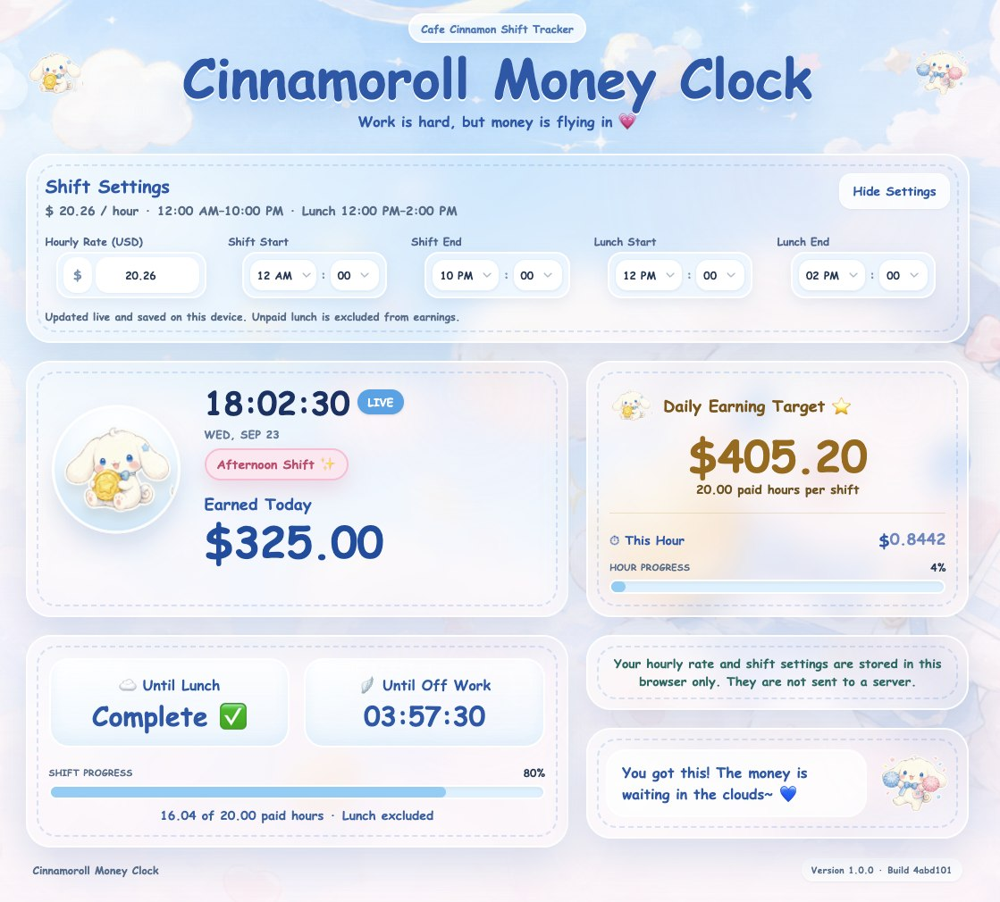
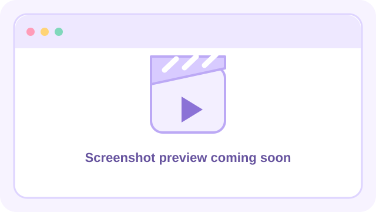

# Hi, I'm Sherry (Lei) Xue 👋

Full-Stack Developer building practical web apps — from healthcare tooling to data dashboards to client sites. Lately exploring how AI can make software genuinely more useful.

## 🛠️ Tech Stack

**Languages** · TypeScript / JavaScript, Python, SQL
**Frontend** · React, Next.js, Tailwind CSS
**Backend** · Node.js, Express, PostgreSQL, REST APIs
**AI** · LLM integration, RAG, agent workflows
**Ops** · Docker, Cloudflare (R2 / Pages / Workers), CI/CD, testing (Vitest, Playwright)

## 🚀 Featured Projects

| Project | What it does | Links |
|---|---|---|
| **MedOps Portal** | Medication operations portal for pharmacy teams — role-based order workflow, inventory, audit trails, plus a FHIR integration slice | [Live demo](https://medops.leixue.dev) · [Repo](https://github.com/lei-xue/med-ops-portal) |
| **MindBridge** | Crisis-support resource navigator with real hotline data and accessibility-first design | [Live](https://leixue.dev/mindbridge/index.html) · [Repo](https://github.com/lei-xue/mindbridge) |
| **DisasterLens** | US disaster declaration explorer on FEMA open data — maps, trends, preparedness info | [Live](https://leixue.dev/disasterlens/index.html) · [Repo](https://github.com/lei-xue/disaster-lens) |
| **CharityCheck** | Verify a charity's legitimacy and 501(c)(3) status via IRS/ProPublica data | [Live](https://leixue.dev/charitycheck/index.html) · [Repo](https://github.com/lei-xue/charity-check) |
| **LeetCode Solutions** | Blind 75 in JS + Java, plus 90+ daily practice and JS-challenge problems | [Repo](https://github.com/lei-xue/leetcode-solutions) |

## 🧪 Tiny Projects

<table>
  <tr>
    <td width="50%" valign="top">
      <strong><a href="https://github.com/lei-xue/cinnamoroll-money-clock">Cinnamoroll Money Clock</a></strong> 
      A cute, privacy-first live earnings clock with a configurable workday and unpaid lunch break. 
      <a href="https://moneyclock.leixue.dev">Live preview</a> · <a href="https://github.com/lei-xue/cinnamoroll-money-clock">Source</a>  
      
    </td>
    <td width="50%" valign="top">
      <strong><a href="https://github.com/lei-xue/cinema-app">Cinemate</a></strong> 
      A React movie browser powered by TMDB. 
      <a href="https://movies.leixue.dev">Live preview</a> · <a href="https://github.com/lei-xue/cinema-app">Source</a>  
      
    </td>
  </tr>
</table>

## 💼 Client Work (source private)

- **WAE International Art Education** — full marketing site, solo build ([live](https://leixue.dev/wae/index.html))
- **Somerville Dental** — dental practice web app ([live](https://leixue.dev/dental/index.html))

## 🌱 Currently

- Deepening healthcare-interop knowledge (FHIR, pharmacy workflows — certified pharmacy technician, CPhT)
- Building AI-assisted tools with real guardrails

📫 Reach me: [hi@leixue.dev](mailto:hi@leixue.dev)
