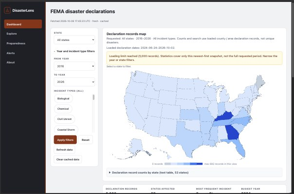

# Hi, I'm Sherry (Lei) Xue

Full-stack developer building practical web apps, from healthcare tooling to data dashboards to client sites. Certified pharmacy technician (CPhT), currently learning healthcare interop (FHIR, pharmacy workflows).

Tech: TypeScript/JavaScript, Python, SQL · React, Next.js, Tailwind · Node.js, Express, PostgreSQL · LLM integration, RAG · Docker, Cloudflare, CI/CD, Vitest, Playwright

## Projects

<table>
  <tr>
    <td width="33%" valign="top">
       
      <a href="https://moneyclock.leixue.dev/">Cinnamoroll Money Clock</a>: live earnings clock for your workday
    </td>
    <td width="33%" valign="top">
       
      <a href="https://movies.leixue.dev/">Cinemate</a>: React movie browser powered by TMDB
    </td>
    <td width="33%" valign="top">
       
      <a href="https://disasterlens.leixue.dev/">DisasterLens</a>: map-first explorer for FEMA disaster records
    </td>
  </tr>
</table>

- [MedOps Portal](https://medops.leixue.dev) ([repo](https://github.com/lei-xue/med-ops-portal)): medication operations portal for pharmacy teams with role-based order workflow, inventory, audit trails and a FHIR integration slice
- [MindBridge](https://mindbridge.leixue.dev/): English/Spanish directory of mental-health support resources
- [CharityCheck](https://charitycheck.leixue.dev/): public records for U.S. nonprofits before you donate

## Client work (source private)

- [WAE International Art Education](https://leixue.dev/wae/index.html): marketing site, solo build
- [Somerville Dental](https://dental-app-amf.pages.dev/): dental practice web app

Contact: [hi@leixue.dev](mailto:hi@leixue.dev)
